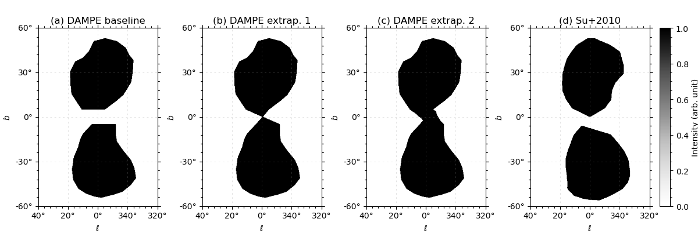

README
======

[![DOI][doi-badge]][doi-link]
[![ArXiv][ref-arxiv-badge]][ref-arxiv-link]
[![SciDB][scidb-badge]][scidb-link]
[![CC BY 4.0][cc-by-shield]][cc-by]

### Introduction
The DArk Matter Particle Explorer (DAMPE) is a space-borne high-energy particle detector that surveys the gamma-ray sky above 2 GeV with a peak acceptance of ~0.2 m^2 sr.

Using 102-month (8.5-yr) photon data, DAMPE has significantly detected the *Fermi* bubbles (~26 sigma significance) and the Galactic center excess (~7 sigma significance).
Details can be found in [the paper](https://doi.org/10.3847/1538-4365/ae58a1).


### Fermi bubbles templates
Here are the *Fermi* bubbles templates, in FITS format, supplementary to the paper (arXiv:2512.23458).
Two projections of the templates are provided: the plate carree (CAR) projection and the all-sky HEALPix projection.
Please note that the values within the boundary of the *Fermi* bubbles are 1.0 (see the preview below).

- **FBs_baseline_total_(proj).fits**  
The *Fermi* bubbles template directly extracted from the DAMPE residual map.

- **FBs_extrap1_total_(proj).fits**, **FBs_extrap2_total_(proj).fits**  
The *Fermi* bubbles templates extrapolated from the baseline map to the low-latitude region.
These two templates are used for evaluating the systematic uncertainties of the Galactic center excess for DAMPE.
The two maps correspond to two extrapolation methods.
Please see Section 4.3 of [the paper](https://doi.org/10.3847/1538-4365/ae58a1) for details.



The FITS files can be visualized with [SAOImageDS9](https://sites.google.com/cfa.harvard.edu/saoimageds9/download), read and manipulated with [astropy](https://www.astropy.org/), and utilized by the data analysis tools (e.g. [fermitools](https://fermi.gsfc.nasa.gov/ssc/data/analysis/software/) and [DmpST](https://dampe.nssdc.ac.cn/dampe/mission.php)).


### Citation
Please cite the paper and database, if you use these templates in your research.
```bibtex
@ARTICLE{DAMPE2025paper,
        title = {Observations of the Fermi Bubbles and the Galactic Center Excess with the Dark Matter Particle Explorer},
       author = {{Alemanno}, Francesca and {An}, Qi and {Azzarello}, Philipp and others},
collaboration = {DAMPE},
      journal = {Astrophys. J. Suppl.},
     keywords = {High Energy Astrophysical Phenomena},
       volume = {284},
       number = {1},
        pages = {22},
         year = "2026",
          doi = {10.3847/1538-4365/ae58a1},
archivePrefix = {arXiv},
       eprint = {2512.23458},
 primaryClass = {astro-ph.HE}
}

@MISC{DAMPE2026data,
      edition = {V1},
        title = {Fermi bubbles templates from DAMPE photon data},
          url = {https://doi.org/10.57760/sciencedb.space.03534},
          doi = {10.57760/sciencedb.space.03534},
       author = {{Shen}, Zhao-Qiang and {Duan}, Kai-Kai},
         year = {2026},
        month = {Feb}
}
```


### Public DAMPE photon data
The public DAMPE gamma-ray data (version 6.0.3) from 3 GeV to 1 TeV are available in [NSSDC](https://dampe.nssdc.ac.cn).


License
-------
This repository is licensed under a
[Creative Commons Attribution 4.0 International License][cc-by].

[![CC BY 4.0][cc-by-image]][cc-by]

[ref-arxiv-badge]: https://img.shields.io/badge/arXiv-2512.23458-b31b1b.svg
[ref-arxiv-link]: https://arxiv.org/abs/2512.23458

[cc-by]: http://creativecommons.org/licenses/by/4.0/
[cc-by-shield]: https://img.shields.io/badge/License-CC%20BY%204.0-lightgrey.svg
[cc-by-image]: https://i.creativecommons.org/l/by/4.0/88x31.png

[scidb-badge]: https://img.shields.io/badge/DB-10.57760/sciencedb.space.03534-white.svg
[scidb-link]: https://doi.org/10.57760/sciencedb.space.03534

[doi-badge]: https://img.shields.io/badge/DOI-10.3847/1538--4365/ae58a1-blue.svg
[doi-link]: https://doi.org/10.3847/1538-4365/ae58a1